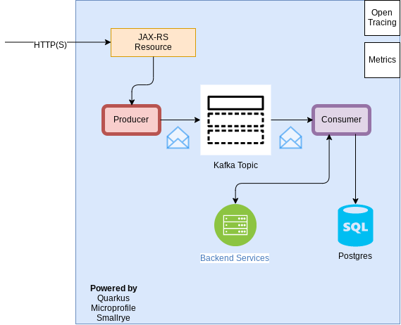

# super-proxy
> A simple and super proxy for mocking and resilience (fault tolerance) needs. Just a POC for now!!

Also a feature demonstration of Quarkus and [Microprofile](https://microprofile.io/), showcasing following capabilities.
* Quarkus Panache
* [Microprofile](https://microprofile.io/) Reactive Messaging
* [Microprofile](https://microprofile.io/) OpenTracing
* [Microprofile](https://microprofile.io/) Metrics

## Architecture

